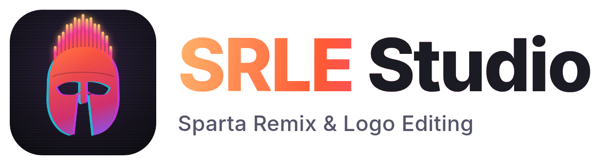

<picture>
  <source media="(prefers-color-scheme: dark)" srcset="assets/branding/wordmark_dark.png">
  
</picture>

# SRLE Studio (Sparta Remix & Logo Editing)

A desktop studio for **Sparta remixes** and **logo-editing style video effects**. The **Sparta Remix Generator** turns any video of someone talking into a full Sparta remix over a real base, followed exactly: pitch, bass and pads on the base's notes, the chorus words in the wiki's patterns, percussion on the base's drums, mixed, mastered and with the classic box video. The effects side has G-Majors, vocoders, CoNfUsIoN, Low Voice, Luig Group, voice changers, glitches, and 260+ more: preview any effect on your clip instantly, then render it, or build a **compilation** that plays your clip through effect after effect, like the classic "X in 40 effects" videos.


[](https://github.com/1ajh/video-effects-studio/actions/workflows/ci.yml)

## What's inside

- **265 effects in 10 categories**, every one rendered through real FFmpeg in CI, and level-matched so each comes out loud and even:
  - **Logo Editing**: recipes checked against their [Logo Editing Wiki](https://logo-editing.fandom.com) pages (Low Voice, Luig Group, Mari Group, CoNfUsIoN, Devil's Blast, Chorded, Crying, Angry, Happy, Sad, Shock, Asleep, Awake, Embarrassed, Blind X, Deaf X, Weird Code, Hitting, Sponge 2.0, Pitch Black, Crazy Diamond, V-Major, You Wiggled X, Sick, I KILLED X, the Color Outs, the Milks, Ear Bleed, Heat Overload, Wind Blower, Inverted Hue Puzzle, Hatsune Miku, Square Head, Morning & Night, Scary Effect, Mystery Effect, M/U/W/I-Major, Meta Major, Broken Major and many more of the wiki's popular effects), with their gradient maps, mirrors, hue settings and pitches as written (AVS pitch rates converted to semitones)
  - **G-Majors & Chords**: G-Major 1, 2, 3, 4, 5, 7, 10, 12, 13, 14, 15, 16, 17, 19 and 100, Deaf Major, AMTVE Major, Archie The Dog Major, the NotSoBot G-Majors, a **Chord Builder** where you type the pitch of every duplicated track, plus a harmonizer, doubler, barbershop quartet, sus4, major seventh, augmented and whole-tone chords
  - **Vocoders & Robots**: real robotized voices (FFT phase vocoding), stacked into chords with the matching looks, and the **IL Vocodex presets** the community builds effects from (Robot, Helium, Elderly, More Testosterone, Group, Power, Old School, Clearer, Backing Voices, Droplets, Autovocoding, Reverb, For Drums) with their wiki gradient maps
  - **Voice Changer**: giant, baby, monster, demon, old man, radio, walkie-talkie, cave, stadium announcer, drunk, dark lord, helium balloon, cartoon, slow-mo, space radio, in a can
  - **Color, Distortion, Glitch, Audio, Time & Speed**: mirrors, swirl, pinch, bulge, kaleidoscope, CRT, VHS, RGB split, datamosh melt, 8-bit, deep fried, vaporwave, bass boost, earrape, 8D audio, reverse, boomerang, stutter, nightcore…
  - **YTPMV tools**: a real **Sparta Sequencer** (plays one sample as the chorus pitch 0 0 +1 +1 −2 −2 +1 +1, any of the Sparta Remix Wiki's pitch patterns, or your own, in time), **Beat Chop** ("1 1 2 1 3 3 4 4") and **Pitch Ladder**
- **Before / after preview**: every effect is rendered as a short preview automatically. Watch it on its own or side by side with the original.
- **Effect thumbnails**: the effect list shows each effect applied to *your* clip.
- **Compilations**: effects play one after another in order. Add effects one by one, a whole category, **every effect**, or **N random** ones; shuffle and drag to reorder. Optionally play the original first, and label each segment with a **name overlay** or a **title card**. Each item keeps its own settings.
- **Sparta Remix Generator** (see below)
- **Trim** any range before rendering, with I/O shortcuts at the playhead.
- **Export** MP4 (H.264/AAC, plays in Discord etc.), WebM, GIF, MP3 or WAV, at High / Balanced / Small quality with an optional resolution cap.
- **Batch**: render one effect over every loaded clip.
- **Presets, favorites and recents**.
- **Custom effects**: write your own FFmpeg filter chains, test them in place, and use them anywhere (compilations included).
- **Render queue** with progress, ETA, cancel, "show in folder", and a persistent history.

## Sparta Remix Generator

The third mode (`Ctrl+3`) makes a Sparta remix the way the community does: a real base, followed exactly, with samples cut from your video. It goes in four steps: **Base → Source → Line → Generate**.

- **Base**
  - **Library**: 560 real bases you can search and download, each credited to its maker and linked to where it was published: Keaton's official Sparta Extended instrumental, the HADES BLACK, Francex and *Some Sparta Bases Archive* collections, single uploads, and 12 bases from the Sparta Archive FLP Remixes that come with their FL Studio project and a render checked against it (marked **Exact**).
  - **Your audio**: any base as MP3/WAV. Tempo, bar 1, where the music ends, the kicks, snares and hats, the chords, the hit notes (matched against every pitch pattern on the Sparta Remix Wiki, in every key) and the sections (the chorus is the loud part the base keeps coming back to; the parts between follow the Sparta order) are worked out by listening. If the file is a library base, its checked transcription is used instead.
  - **Your project**: FL Studio `.flp`, FL Studio Mobile `.flm` or MIDI, with the base's audio (lined up automatically) or re-synthesized. The base's notes are read exactly (hits, bass line and chords); pick the hit/lead track if the automatic choice is wrong.
- **What the remix plays** (all from the base, nothing made up), and nothing after the base ends:
  - the **pitch sample** plays the base's own hit notes, hard-tuned to the base's root (or *Natural*, keeping the voice's wobble). Where a section has no hits of its own, the wiki's pattern for it plays, fitted to the base's chords;
  - the **bass** (a voiced syllable tuned down to D2, or your base's root) plays the base's bass line, and the **pads** (a vowel stretched into a pad) play its chords; both can be switched off globally or per section;
  - the **chorus words** play the wiki's word patterns: the standard chorus, DunDunDenDen's 1-2-3A-3B, the epicness and madness patterns, only in the sections that have them; a long intro plays the chorus after the quote. The chorus is words only by default;
  - the **percussion** lands on the base's own kicks, snares and hats;
  - the **quote** (your whole line) opens the intro.
- **Pitched notes**: *Stretch* (default) re-pitches every note with its length kept, like FL Studio's stretch mode, so voices don't turn into chipmunks; *Resample + crossfades* plays them like a sampler (pitch and speed together) with automatic crossfades between notes.
- **Keaton's Sparta Extended base** ships with a checked transcription: its 13 sections, the D–D#–C–D# progression, its bass line, chords and drums, and the wiki's original patterns in their places (Awesomeness 1 before the madness, Awesomeness 2 opening the final chorus).
- **Source and line**: everything is cut from your sources. The app finds the spoken lines; you pick one and its words become the chorus samples, numbered in order (syllables of a word are 3A, 3B…). Play each word, drag the cuts between words, split, join or trim them. Nothing is layered from anywhere else unless you switch on the synth drum body (off by default: that would be a fake sample). Chorus Crisp is on by default.
- **Fix the base**: transcriptions from audio are drafts, so everything is editable: relabel, rename, split, merge or drag sections (the classics plus pre- and post-epicness), change the root, move or replace a section's hits with a wiki pattern, fix its kick/snare/hat, nudge beat 1. Fixes are kept per base. **Send your fixes** saves the transcription and opens a filled-in GitHub issue; approved ones are added to the catalog with your credit, for everyone.
- **Per section**: choose any of the wiki's word and pitch patterns (classics, freestyles, KingSpartaX37's madness and the rest), or type your own in wiki notation.
- **Random mode** (off by default) can use chorus freestyles, other pitch patterns, other samples per section and a different section layout. *Another take* re-rolls it.
- **Video**: the classic box grid by default: one box per sample (pitch, bass, pads, each word, and the kick, snare and hat along the bottom row), sized automatically (2×2, 3×3 or 4×4), flipping horizontally on every hit, black between hits, and the quote full screen. Every one of those is an option (grid size; which boxes flip and how; black, dimmed or held last frame; quote full screen, in its own box or as a title card), plus Modern, Chaos/YTPMV and Minimal styles.
- **Mix and export**: stretched or resampled notes, choke per lane, a bus per lane, the base ducked under the quote, then a **Clean** (≈ −10 LUFS, −1 dB peak) or **Hot** master. Export the video (or MP3/WAV), plus optional **stems** (base, pitch, bass, pads, words, drums, quote) and **MIDI** (the sample chart and the base's notes).

> **Volume**: by default every render is level-matched to about −9 LUFS with a −1 dB peak (*Loud & consistent*). The effect's audio is measured first, then turned up or down, soft-clipped and limited, so quiet effects like vocoders come out as loud as the rest. Effects that are loud on purpose (🔊 badge) are never turned down. Choose *Standard* (−14 LUFS) or *As the effect makes it* under Output → Volume.

## Download

SRLE Studio costs $50, once, from **[srle.ajh.wtf](https://srle.ajh.wtf)**: you get a license key that unlocks it on up to 3 computers. The builds are on the public repository's [Releases](https://github.com/1ajh/srle-studio/releases) (the app checks there for updates). FFmpeg is bundled, so there's nothing else to install.

| Platform | File | Notes |
|---|---|---|
| Windows 10/11 | `SRLEStudio-windows.zip` | Unzip and run `srle_studio.exe` |
| macOS 12+ | `SRLEStudio-macos.dmg` | Unsigned: right-click → Open the first time |
| Linux (x64) | `SRLEStudio-linux.tar.gz` | Needs GTK 3 and **libmpv** for in-app playback (`sudo apt install libmpv2`) |

Rendering runs FFmpeg locally, so phones and browsers can't do it. The web/mobile builds just show a link to the store.

## Using it

1. **Add a clip**: drag it anywhere onto the window, or press `Ctrl+O`.
2. **Pick an effect** on the left. A preview renders on its own (`Ctrl+P` to force it).
3. Tweak **parameters** in the inspector on the right, and set the **output** format and folder below them.
4. **Render** (`Ctrl+Enter`). Jobs appear in the queue (`Ctrl+Q`).

**Sparta Remix mode** (`Ctrl+3`): pick a base, add your sources, confirm the line, press **Generate remix**, review, then **Render remix**.

**Compilation mode** (`Ctrl+2`): add effects with the ➕ button, double-click, or `Ctrl+D`, or use *All effects / Add category / Random* in the dock at the bottom. Click a card to edit that item, drag to reorder, and choose *Original first* and a label style. Then render.

### Shortcuts

| Keys | Action |
|---|---|
| `Ctrl+O` | Add clips |
| `Ctrl+Enter` | Render |
| `Ctrl+P` | Preview now |
| `Space` / `Home` | Play-pause / back to start |
| `I` / `O` | Set trim in / out |
| `Ctrl+F`, `↑` `↓` | Search / step through effects |
| `Ctrl+D` | Add effect to the compilation |
| `Ctrl+1` / `2` / `3` | Single effect / Compilation / Sparta Remix mode |
| `1` `2` `3` | Original / Effect / Split view |
| `Ctrl+H`, `Ctrl+,`, `F1` | History, Settings, Help |

## Building from source

Requirements: Flutter 3.47+ and FFmpeg on your `PATH` (or pick it in Settings → FFmpeg).

```bash
flutter pub get
flutter run -d windows   # or macos / linux
```

Linux build dependencies:

```bash
sudo apt install clang cmake ninja-build pkg-config libgtk-3-dev liblzma-dev libmpv-dev ffmpeg
```

Debug builds run without a key. Release builds need the store's public key (`--dart-define=SRLE_LICENSE_PUBLIC_KEY=…`, see [Licensing](#licensing-and-the-store)).

### Tests

```bash
flutter test --exclude-tags ffmpeg   # unit + widget tests (~990)
(cd store && npm test)               # the store
flutter test --tags ffmpeg           # renders every effect and full Sparta remixes with real FFmpeg
VFX_FFMPEG=/path/to/ffmpeg flutter test --tags ffmpeg   # against a specific build
```

The FFmpeg suite renders every effect on a clip with audio and on an odd-sized clip without audio, and runs the whole Sparta pipeline (sources → line, words and samples → project, audio-only and library bases → mix → video in every visual style). It also covers every output format, all compilation label modes, skipped-segment handling, previews and thumbnails. CI runs it against Ubuntu's FFmpeg 6.1, and it also passes on current FFmpeg master.

## How effects work

Effects are declared in `lib/core/effects/library/`. Each effect gets a label for the incoming stream and returns the label of its output, building a `-filter_complex` graph with shared blocks (`lib/core/ffmpeg/blocks.dart`): pitch shifting without rubberband, pitch chords, mirrors, waves, swirl, radial pinch/bulge, TV simulator, light rays, gradient maps and more.

```dart
Effect(
  id: 'luig_group',
  name: 'Luig Group',
  description: 'HSL Adjust "Invert Color" hue flip with the pitch set to −1.',
  category: EffectCategory.logoEditing,
  video: vf(hslInvert),
  audio: af(pitch(-1)),
),
```

The command builder takes care of the boring parts: argument lists (no shell quoting), trimming, even frame sizes, `yuv420p`, 48 kHz stereo, clips without audio, exact segment lengths for compilations, and output encoders.

```
lib/
  core/        effects, FFmpeg command building, rendering (pure Dart, fully tested)
    audio/     DSP: FFT, YIN, onsets, TD-PSOLA, filters, dynamics, synthesis
    sparta/    base catalog, wiki pattern library, FLP/FLM/MIDI readers, project and audio
               transcription, line & sample finder, enhancer, charter, mixer, visual renderer
  state/       controllers (project, editor, compilation, preview, queue, library, settings, sparta)
  ui/          the editor: browser, preview, inspector, compilation dock, Sparta workspace, queue, pages
```

## Licensing and the store

- **The store** ([`store/`](store)) is the site at srle.ajh.wtf: orders paid by Cash App or Apple Pay, an admin page that marks them paid and makes each a license key, and the activation API. It's plain Node with no dependencies; [store/README.md](store/README.md) covers running it on the VPS.
- **Keys**: the app asks for the key once, sends it with a fingerprint of the computer to `/api/activate`, and keeps the Ed25519-signed answer. After that it checks the signature offline against the public key built into the release (`lib/core/licensing/`). The admin page can revoke a key or reset its computers.
- **The public repository** [1ajh/srle-studio](https://github.com/1ajh/srle-studio) holds the releases, the base catalog and transcriptions (the app reads them from there), and issues. Its README, licenses, issue templates and the transcription workflow live in [`public-repo/`](public-repo); `tool/publish_public_repo.sh <checkout>` copies them, the logo and `bases/` into a checkout of it.
- **Releases**: *Build and Release* builds with the newest `bases/` from the public repository and publishes there. It needs the `SRLE_LICENSE_PUBLIC_KEY` Actions variable (the store's public key) and a `PUBLIC_REPO_TOKEN` secret (a fine-grained token with *Contents: read and write* on 1ajh/srle-studio).

## Credits

- Sparta patterns and section names come from the [Sparta Remix Wiki](https://spartaremix.fandom.com/wiki/Category:Sparta_Remix_Components) (CC BY-SA); bases are credited to their makers in the app
- Sparta techniques draw on the community's tools: PSOLA pitch correction as in Pet297's *PitchCorrector297*, Chorus Crisp and SlamShaper-style shaping from composition-cassidy's tools, and grid visuals like *Sparta Remix Visual Editor*
- Effect recipes are inspired by the [Logo Editing Wiki](https://logo-editing.fandom.com/wiki/Category:Effects) community and the original NotSoBot tags by **AJH**
- [FFmpeg](https://ffmpeg.org), [Flutter](https://flutter.dev), [media_kit](https://github.com/media-kit/media-kit), [Inter](https://rsms.me/inter/) (SIL OFL)

© AJH, all rights reserved, see [LICENSE](LICENSE). Third-party licenses (FFmpeg, Inter, the wikis) are in [THIRD_PARTY_NOTICES.md](THIRD_PARTY_NOTICES.md), which every download includes.
